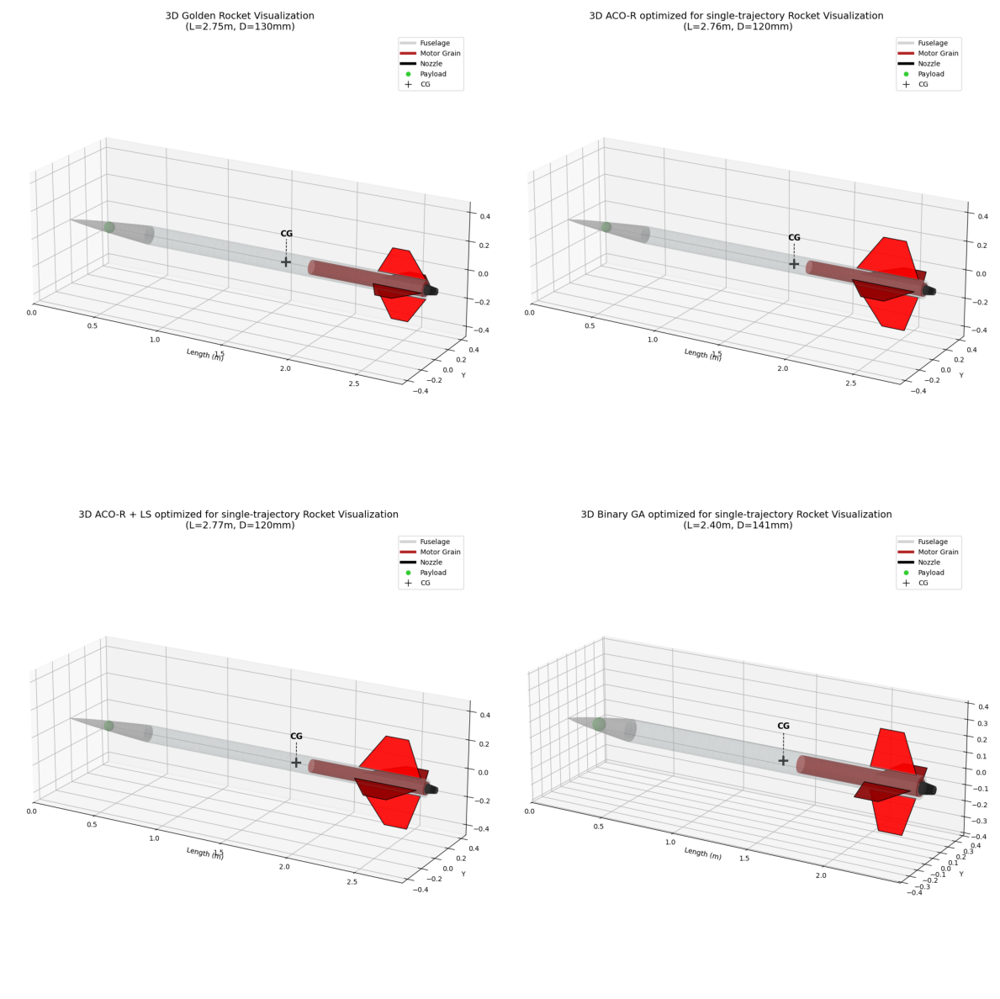
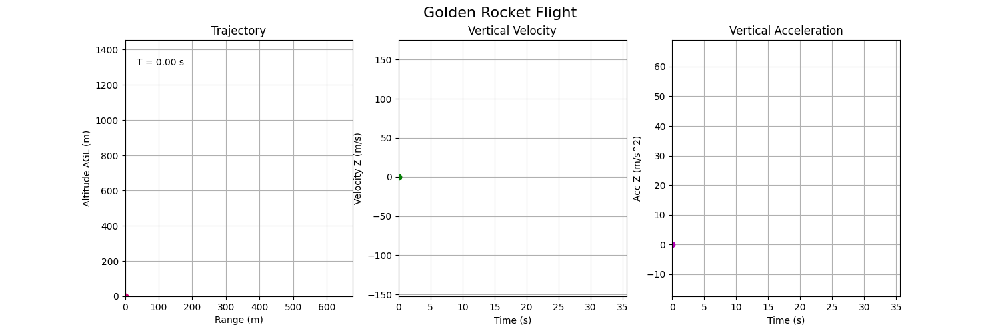
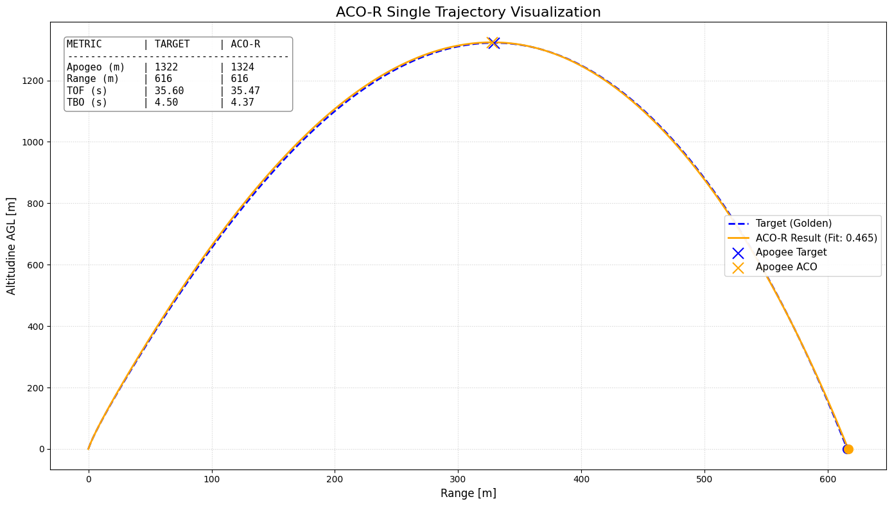
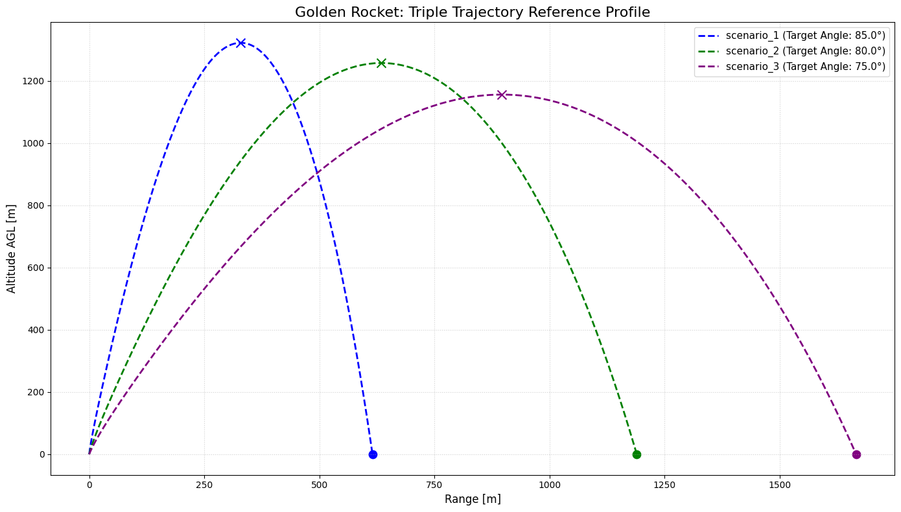
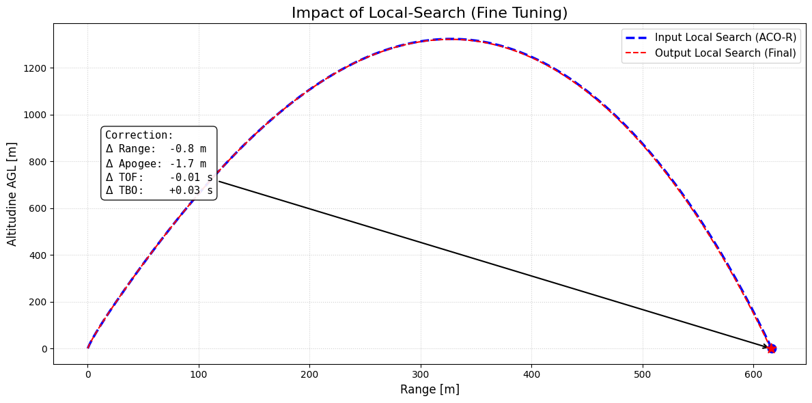
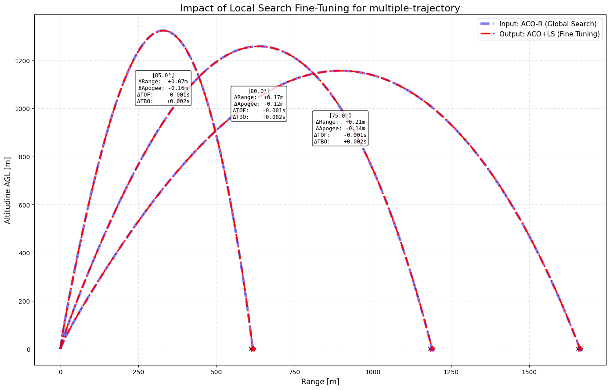
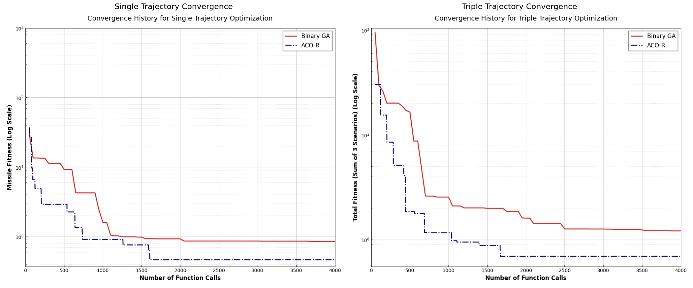

# Missile Trajectory Optimization Using Ant Colony Algorithm, python implementation

This project implements a robust framework for optimizing high-power rocket designs using metaheuristic algorithms. By integrating **RocketPy** for high-fidelity physics simulations, the system applies **Continuous Ant Colony Optimization (ACO-R)** and **Hybrid Local Search (Nelder-Mead)** to "reverse engineer" optimal geometric and propulsive parameters. The goal is to design a rocket capable of matching specific flight trajectories such as Range, Apogee, and Time of Flight (TOF) under realistic environmental conditions, benchmarking performance against a standard Binary Genetic Algorithm.

This project contains the material for the final exam project of the Optimization for Artificial Intelligence course for the academic year 2025-26. This course is offered by UniTS (Università degli Studi di Trieste), Trieste, Italy.



**Fitness Results:**

| **Algorithm** | **Single Trajectory** | **Triple Trajectory** |
| :--- | :--- | :--- |
| **ACO-R (Base)** | 0.4651143355158348 | 0.6948414355449155 |
| **ACO-R + LS (Hybrid)** | 0.1924121875700345 | 0.6479974401935903 |
| **Binary GA** | 0.8490712359291793 | 1.2148988386486272 |

## Table of Contents

- [Introduction](#introduction)
- [Structure](#structure)
- [Tasks and goal setting](#tasks-and-goal-setting)
- [Usage](#usage)
- [Key Implementation Details](#key-implementation-details)
- [Results](#results)
    - [Single Trajectory Results](#single-trajectory-results)
    - [Triple Trajectory Results](#triple-trajectory-results)
    - [Impact of the Local Search ](#impact-of-the-local-search)
    - [Convergence History](#convergence-history)
- [Author](#author)
- [References](#references)


## Introduction

Aerospace design involves complex, non-linear trade-offs between aerodynamics, propulsion, and mass distribution. Traditional gradient-based optimization often fails due to the "noisy" nature of flight simulations.

This project explores the efficacy of **Ant Colony Optimization (ACO)** adapted for continuous domains (ACO-R) to solve the inverse design problem. The framework simulates a "Golden Rocket" (a reference design known to be physically valid) to generate target flight data. The optimizer must then rediscover a set of design parameters (fuselage dimensions, fin geometry, motor impulse) that replicate this flight profile with minimal error.

Finally, a comparison with traditional genetic algorithms (**Binary GA**) has been performed, to evaluate the quality of the ACO-R algorithm.


## Structure

```bash
missile_optimization_aco/
│
├── config/                                 # Configuration files for Physics and Algorithms
│   ├── missile_constraints.yaml            # Design variables bounds and Golden Rocket targets
│   └── optimization_parameters.yaml        # Algorithm settings (ACO budget, GA pop size, etc.)
│
├── notebooks/                              # Interactive Jupyter Notebooks
│   ├── final_results_comparison.ipynb      # Statistics, aggregated plots, and final tables
│   ├── simulate_rocket.ipynb               # Golden Rocket simulation and Ground Truth generation
│   ├── single_trajectory_optimization.ipynb # Task A: Optimization for one launch angle
│   └── triple_trajectory_optimization.ipynb # Task B: Multi-objective optimization (3 angles)
│
├── optimizer/                              # Source code for optimization algorithms
│   ├── ACO_R.py                            # Continuous Ant Colony Optimization class
│   ├── binary_GA.py                        # Binary Genetic Algorithm class
│   └── nelder_mead.py                      # Nelder-Mead Simplex (Local Search) class
│
├── plots/                                  # Generated visualizations and graphs
│   ├── Single_trajectory/                  # Plots specific to Task A
│   │   ├── ACO-R_LS_rocket_design.png
│   │   ├── ACO-R_LS_trajectory.png
│   │   ├── ACO-R_rocket_design.png
│   │   ├── ACO-R_trajectory.png
│   │   ├── Binary_GA_rocket_design.png
│   │   ├── Binary_GA_trajectory.png
│   │   ├── convergence_history.png
│   │   ├── final_results_time_fitness.png
│   │   ├── impact_of_LS.png
│   │   └── time_best_fitness_barplot.png
│   │
│   ├── Triple_trajectory/                  # Plots specific to Task B
│   │   ├── ACO-R_LS_rocket_design.png
│   │   ├── ACO-R_LS_trajectory.png
│   │   ├── ACO-R_rocket_design.png
│   │   ├── ACO-R_trajectory.png
│   │   ├── Binary_GA_rocket_design.png
│   │   ├── Binary_GA_trajectory.png
│   │   ├── convergence_history.png
│   │   ├── final_results_time_fitness.png
│   │   ├── impact_of_LS.png
│   │   ├── time_best_fitness_barplot.png
│   │   └── triple_trajectory_reference_profile.png
│   │
│   ├── 2D_golden_rocket_design.png         # Matplotlib blueprint of the target rocket
│   ├── 3D_golden_rocket.png                # 3D visualization of the target rocket
│   ├── golden_rocket_flight.gif            # Animation of the reference flight
│   └── Physical_error_comparison.png       # Aggregated physical error metrics
│
├── results/                                # CSV Data logs for analysis
│   ├── single_trajectory/
│   │   ├── final_performance_single.csv    # Metrics summary for Task A
│   │   └── single_trajectory_parameters.csv # Parameter convergence for Task A
│   │
│   ├── triple_trajectory/
│   │   ├── ACO-R_LS_results_trajectories.csv
│   │   ├── ACO-R_results_trajectories.csv
│   │   ├── Binary_GA_results_trajectories.csv
│   │   ├── final_performance_triple.csv    # Metrics summary for Task B
│   │   └── triple_trajectory_parameters.csv # Parameter convergence for Task B
│   │
│   └── global_fitness_comparison.csv       # Merged table (Single vs Triple fitness)
│
├── simulation/                             # Physics Engine wrappers
│   ├── rocket_factory.py                   # RocketPy object generator and physics logic
│   └── trajectory_evaluation.py            # Fitness function and simulation environment
│
├── LICENSE.txt                              # Project license
├── README.md                               # Project documentation
└── requirements.txt                        # Project dependencies 
```


## Tasks and goal setting

The optimization is divided into two distinct complexity levels:

### 1. The Search Space
The optimizer modifies **11 continuous design variables** within strict engineering constraints defined in `config/missile_constraints.yaml`:
*   **Geometry:** Radius, Body Length, Nose Length.
*   **Aerodynamics:** Fin Span, Chord (Root/Tip), Sweep Angle, Position.
*   **Propulsion:** Total Impulse, Burn Time (Synthesized Thrust Curve).



### 2. Task A: Single Trajectory Optimization
*   **Objective:** Match the flight profile of the reference rocket launched at an **85° inclination**.
*   **Challenge:** Find a design that matches Range, Apogee, Time of Flight (TOF), and Time to Burnout (TBO).

Example of ACO-R algorithm:



### 3. Task B: Triple Trajectory (Multi-Objective)
*   **Objective:** Find a **single** rocket design capable of performing optimally across three different mission profiles simultaneously:
    1.  Launch at **85°** (High Altitude target).
    2.  Launch at **80°** (Mid-range target).
    3.  Launch at **75°** (Long-range target).
*   **Challenge:** This requires a robust design, as maximizing performance for one angle often degrades it for another.

Example Multi-Scenario Match (triple trajectory):



## Usage

### Prerequisites
*   Python 3.8+
*   Libraries: `rocketpy`, `numpy`, `pandas`, `matplotlib`, `scipy`, `pyyaml`, `seaborn`.

### Installation

1.  **Clone the repository**
    ```bash
    git clone https://github.com/tavaa/Missile_trajectory_optimization_using_ACO.git
    cd missile_optimization_aco
    ```

2.  **Create and activate a virtual environment** (Recommended)
    
    *   **Linux / macOS:**
        ```bash
        python3 -m venv venv
        source venv/bin/activate
        ```
    *   **Windows:**
        ```bash
        python -m venv venv
        .\venv\Scripts\activate
        ```

3.  **Install dependencies**
    ```bash
    pip install -r requirements.txt
    ```

### Execution Flow

The project is organized into Jupyter Notebooks to be run sequentially:

1. `notebooks/simulate_rocket.ipynb`:
* Validates the physics engine.
* Simulates the "Golden Rocket".
* Generates the Ground Truth targets for the configuration files.

2. `notebooks/single_trajectory_optimization.ipynb`:
*Runs ACO-R, ACO-R + Local Search, and Binary GA on Task A.
*Visualizes convergence and trajectory matching.

3. `notebooks/triple_trajectory_optimization.ipynb`:
*Runs the multi-objective optimization (Task B).
*Visualizes the compromise solution across the three scenarios.

4. `notebooks/final_results_comparison.ipynb`:
*Aggregates data and produces final statistical tables and plots.


## Key Implementation Details

### Physics Engine (RocketPy Wrapper)

**Dynamic Drag**: Skin friction drag is calculated dynamically based on the wetted area of the generated geometry 
(Cd​∝L/D).

**Analytical Inertia**: Moments of inertia are calculated using the Parallel Axis Theorem for every component (nose, body, fins, motor) to ensure realistic stability.

**Synthetic Motor**: A trapezoidal thrust curve is generated programmatically to match the requested Total Impulse and Burn Time.

### Algorithms

**ACO-R (Continuous Ant Colony)**:

* Uses a solution archive and a Gaussian Kernel PDF to sample new solutions.

* Implements an "Extra Elitism" *(qmod)* factor to intensify search around the best solution.

**Hybrid Approach (ACO + LS)**:

* Uses ACO for global exploration.

* Triggers a *Nelder-Mead Simplex* (Local Search) when stagnation is detected or at the end of the run to fine-tune the parameters to high precision.

**Binary GA**:

* Standard genetic algorithm with 16-bit encoding per parameter used as a performance benchmark.


## Results

### Single Trajectory Results

The Hybrid ACO+LS approach demonstrated superior performance, achieving near-perfect trajectory matching.

* ACO-R + LS: Achieved near-zero error on Range and Apogee.

* Binary GA: Struggled with fine-tuning continuous variables (e.g., Burn Time) due to discretization limits.

### Triple Trajectory Results

The algorithm successfully found a robust design capable of fulfilling all three mission profiles with an average error of < 1.5 meters on ranges exceeding 1000 meters.

* The optimizer utilized the physical trade-offs (e.g., reducing diameter to lower drag, increasing fin size for crosswind stability) to satisfy the multi-objective constraints.

### Impact of the Local Search 

The application of the **Local Search** acted as a fine-tuning mechanism, drastically reducing residual errors. In the *Single Trajectory* task, the hybrid approach reduced the fitness cost from **0.4651** (Base ACO) to **0.1924**, effectively eliminating geometric discrepancies in Range and Apogee.  In the *Triple Trajectory* task, the hybrid approach reduced the fitness cost from **0.6948** (Base ACO) to **0.6480**

This demonstrates that the hybrid strategy successfully combines the exploration capabilities of population-based metaheuristics with the exploitation power of direct search methods.

Impact of the Local Search (single-trajectory):



Impact of the Local Search (triple-trajectory):



### Convergence History

he comparative analysis of the convergence history reveals a significant efficiency gap between the continuous and discrete approaches, for both tasks:

* **ACO-R**: The algorithm exhibited a steep learning curve, drastically reducing the fitness value within the first 1,500 function calls. This confirms the effectiveness of the Gaussian Kernel in guiding the search towards promising regions without the quantization errors associated with binary encoding.

* **Binary GA**: The Genetic Algorithm displayed a characteristic "step-wise" convergence profile. It required a significantly larger computational budget to approach the results that ACO-R achieved early in the process, ultimately stalling due to the limits of the 16-bit parameter discretization.

Example Convergence:



## Author

Matteo Tavano

* GitHub: @tavaa

* Email: matteo.tavano@studenti.units.it

## References

1. Kiyak, Z. J., Hartfield, R. J., & Ledlow, T. W. (2014). Missile Trajectory Optimization Using a Modified Ant Colony Algorithm. Auburn University. https://www.semanticscholar.org/paper/Missile-trajectory-optimization-using-a-modified-Kiyak-Hartfield/4b52688ff709a352cb08fc3c28126953b58ea21b

2. Socha, K., & Dorigo, M. (2008). Ant colony optimization for continuous domains. European Journal of Operational Research. https://iridia.ulb.ac.be/~mdorigo/Published_papers/All_Dorigo_papers/SocDor2008ejor.pdf

3. RocketPy Team. RocketPy: A Six-Degree-of-Freedom Rocket Trajectory Simulator. https://github.com/RocketPy-Team/RocketPy


